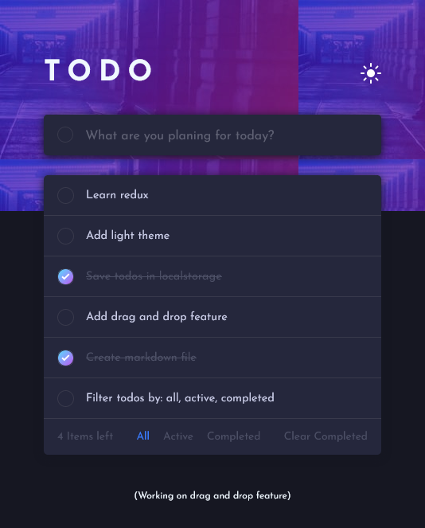

# Frontend Mentor - Todo app solution

This is a solution to the [Todo app challenge on Frontend Mentor](https://www.frontendmentor.io/challenges/todo-app-Su1_KokOW).

Yep here is my first project using [React](https://reactjs.org/), and I am happy with it. I have not covered a lot in [React](https://reactjs.org/), but I decided to implement what I had learned first then move on to learn new things. 

## Table of contents

- [Overview](#overview)
  - [The challenge](#the-challenge)
  - [Screenshot](#screenshot)
  - [Links](#links)
- [My process](#my-process)
  - [Built with](#built-with)
  - [What I learned](#what-i-learned)
  - [What next?](#what-next)
  - [Useful resources](#useful-resources)
- [Author](#author)

## Overview

### The challenge

Users should be able to:

- [x] View the optimal layout for the app depending on their device's screen size
- [x] See hover states for all interactive elements on the page
- [x] Add new todos to the list
- [x] Mark todos as complete
- [x] Delete todos from the list
- [x] Filter by all/active/complete todos
- [ ] Clear all completed todos
- [ ] Toggle light and dark mode
- [ ] **Bonus**: Drag and drop to reorder items on the list

### Screenshot

### Links

- Solution URL: [https://github.com/GHamza-Dev/react-todo-app](https://github.com/GHamza-Dev/react-todo-app)
- Live Site URL: [https://react-todo-app-orcin.vercel.app/](https://react-todo-app-orcin.vercel.app/)

## My process

### Built with

- Semantic HTML5 markup
- CSS custom properties
- Flexbox
- Mobile-first workflow
- localStorage API
- [React](https://reactjs.org/) - JS library

### What I learned
- Managing data (state property)
- Updating state property (setState)
- Passing data (props)
- Handling events

### What next?
 
 - Routing
 - axios
 - Redux
 - React Hooks
 - ...

### Useful resources

- [Frontend Mentor](https://www.frontendmentor.io/challenges/todo-app-Su1_KokOW) - challenge, images, design...
- [React](https://reactjs.org/) - React website
## Author

- Website - [GASSAI Hamza](https://github.com/GHamza-Dev)
- Frontend Mentor - [GHamza-Dev](https://www.frontendmentor.io/profile/GHamza-Dev)

